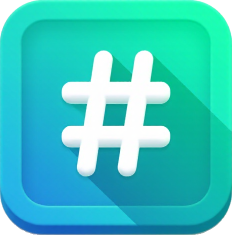

<!-- PROJECT LOGO -->
<br />
<div align="center">
  <a href="https://github.com/Niks-Kozlovs/ToDoList">
    
  </a>

  <h3 align="center">Hash Table Game</h3>

  <p align="center">
     A simple educational game to understand hash tables and ASCII values.
    <br />
    <a href="https://github.com/Niks-Kozlovs/ToDoList/issues/new">Report Bug</a> ·
    <a href="https://github.com/Niks-Kozlovs/ToDoList/issues/new?labels=enhancement">Request Feature</a>
  </p>
</div>

---

<!-- TABLE OF CONTENTS -->
<details>
  <summary>Table of Contents</summary>
  <ol>
    <li><a href="#about-the-project">About The Project</a></li>
    <li><a href="#features">Features</a></li>
    <li><a href="#improvements">Improvements</a></li>
    <li><a href="#built-with">Built With</a></li>
    <li><a href="#getting-started">Getting Started</a>
      <ul>
        <li><a href="#prerequisites">Prerequisites</a></li>
        <li><a href="#build">Build</a></li>
      </ul>
    </li>
    <li><a href="#license">License</a></li>
    <li><a href="#contact">Contact</a></li>
    <li><a href="#acknowledgments">Acknowledgments</a></li>
  </ol>
</details>

---

## About The Project

https://github.com/user-attachments/assets/c16e3f75-76f9-476b-956f-bba86bcd8340


This project is an educational game designed to help users learn about hash tables and ASCII values. Players calculate the hash index of given words using a simple hash formula, enhancing their understanding of how hashing works in data structures.

## Features

**Word Hashing**: Calculates hash indexes based on ASCII values of word characters.  
**Step-by-Step Instructions**: Detailed in-game instructions to guide players through the hashing process.  
**Dynamic Word Generation**: Generates different words each round to provide a varied experience.  
**Scoring System**: Track and display scores to encourage learning through play.

## Improvements

This version focuses on code quality, organization, and efficiency, with key updates:

- **MVC Design Pattern**: Adopts the MVC pattern for clearer file structure and better separation of logic and user interface.
- **Object-Oriented Design**: Replaces hash tables with classes to support a cleaner, modular OOP approach.
- **Reduced Bugs and Enhanced Usability**: The improved structure makes task-loading and other processes simpler and more reliable, often requiring only minimal parameter adjustments.
- **Less Code, Greater Efficiency**: Implements the DRY (Don’t Repeat Yourself) principle, significantly reducing redundant code.
- **Simplified Logic**: Adopts KISS (Keep It Simple, Stupid) principles by using built-in libraries for date and time management, replacing the manual, error-prone implementations in the original code.
- **Improved Naming Conventions**: Variables and functions are now named more intuitively for easier understanding and navigation.

---

## Built With

![HTML] ![CSS] ![JavaScript]

---

## Getting Started

To play the game locally, simply open `index.html` in any modern browser. No additional software is required.

### Prerequisites

Any modern web browser (such as Chrome, Firefox, Edge, or Safari) is required to play the game.

### Installation

1.  Clone the repo:

    ```sh
    git clone https://github.com/your-username/your-repo.git
    ```
2. Navigate to the project folder:
    ```sh
    cd HashTableGame
    ```
3. Open `index.html` in your preferred browser.


---

## License

Distributed under the Unlicense License. See `LICENSE.txt` for more information.

---

## Contact

Niks Kozlovs - [@NiksKozlovs](https://x.com/NiksKozlovs) - kozlovs.niks1@gmail.com

[product-screenshot]: img/demo.mp4
[HTML]: https://img.shields.io/badge/HTML-%23E34F26.svg?logo=html5&logoColor=white
[CSS]: https://img.shields.io/badge/CSS-1572B6?logo=css3&logoColor=fff
[JavaScript]: https://img.shields.io/badge/JavaScript-F7DF1E?logo=javascript&logoColor=000
